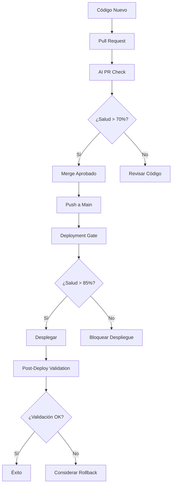

# 🤖 AI-Driven DevOps Documentation / Documentación DevOps IA

## 🌍 Choose Your Language / Elige tu Idioma

### 📖 Complete Documentation / Documentación Completa

- **🇺🇸 [English Documentation](README-EN.md)**
  - Complete guide in English
  - Implementation examples
  - Configuration parameters
  - Troubleshooting guide

- **🇪🇸 [Documentación en Español](README-ES.md)**
  - Guía completa en español
  - Ejemplos de implementación
  - Parámetros de configuración
  - Guía de solución de problemas

## 🚀 Quick Start / Inicio Rápido

### English
This AI-Driven DevOps system provides intelligent analysis for your deployment pipeline using AWS Bedrock. Choose your language above for the complete documentation.

### Español
Este sistema de DevOps impulsado por IA proporciona análisis inteligente para tu pipeline de despliegue usando AWS Bedrock. Elige tu idioma arriba para la documentación completa.

## 📊 Key Features / Características Principales

- **🚦 Pre-Deployment Analysis** / **Análisis Pre-Despliegue**
- **✅ Post-Deployment Validation** / **Validación Post-Despliegue**  
- **📈 Continuous Monitoring** / **Monitoreo Continuo**
- **🤖 AI-Powered Decisions** / **Decisiones Impulsadas por IA**

---

# 🇺🇸 English Documentation

## 🎯 Overview

This AI-Driven DevOps system provides intelligent analysis and decision-making for your deployment pipeline using AWS Bedrock AI models. It performs comprehensive health checks, analyzes system metrics, and provides recommendations for deployment decisions.

## 🔄 How It Works

### 🧠 AI Analysis Engine

The system uses **AWS Bedrock** (Amazon Nova Pro) to analyze:
- **Application Performance**: Response times, throughput, error rates
- **Infrastructure Health**: CPU, memory, disk usage, network metrics
- **Kubernetes Metrics**: Pod status, resource utilization, scaling events
- **Historical Patterns**: Trend analysis and anomaly detection

### 📊 Analysis Types

#### 1. **Pre-Deployment Analysis** 🚦
**Purpose**: Prevent problematic deployments before they happen

**Characteristics**:
- **Timing**: Before deployment execution
- **Data Source**: Historical data and simulations
- **Decision Power**: Can **BLOCK** deployments
- **Threshold**: 70-85% depending on environment
- **Mode**: `blocking-mode: true`

**Use Cases**:
- Pull Request validation
- Production deployment gates
- Release candidate approval

#### 2. **Post-Deployment Analysis** ✅
**Purpose**: Validate deployment success and system stability

**Characteristics**:
- **Timing**: After deployment completion
- **Data Source**: Real-time system metrics
- **Decision Power**: Reports status, suggests rollback
- **Threshold**: 85%+ for production validation
- **Mode**: `blocking-mode: false`

**Use Cases**:
- Deployment validation
- Health monitoring
- Rollback recommendations

#### 3. **Continuous Monitoring** 📈
**Purpose**: Ongoing system health surveillance

**Characteristics**:
- **Timing**: Scheduled (every 6 hours) or on-demand
- **Data Source**: Live system metrics
- **Decision Power**: Creates alerts and issues
- **Threshold**: 80% for monitoring alerts
- **Mode**: `blocking-mode: false`

## 🛠️ Workflow Types

### 1. **Pull Request Check** (`pull-request-check.yml`)
```yaml
# Triggered on: PR creation/updates
# Purpose: Early feedback on code changes
# Blocking: No (informational only)
# Threshold: 70% (permissive for development)
```

**Features**:
- AI analysis of proposed changes
- Automated PR comments with health scores
- Non-blocking validation
- Development-friendly thresholds

### 2. **Deployment Gate** (`deployment-gate.yml`)
```yaml
# Triggered on: Push to main branch
# Purpose: Production deployment protection
# Blocking: Yes (can prevent deployment)
# Threshold: 85% (strict for production)
```

**Features**:
- Real-time system analysis
- Deployment blocking capability
- Production-grade validation
- Immediate feedback on deployment readiness

### 3. **Post-Deployment Validation** (`post-deployment-validation.yml`)
```yaml
# Triggered on: Manual after deployment
# Purpose: Validate deployment success
# Blocking: No (reports status)
# Threshold: 85% (high for validation)
```

**Features**:
- Stabilization waiting period
- Extended monitoring duration
- Double validation (initial + final)
- Comprehensive deployment reports
- Rollback recommendations

### 4. **Scheduled Monitoring** (`ai-scheduled-monitoring.yml`)
```yaml
# Triggered on: Cron schedule (every 6 hours)
# Purpose: Continuous health surveillance
# Blocking: No (monitoring only)
# Threshold: 80% (balanced for alerts)
```

**Features**:
- Multi-environment monitoring
- Automated issue creation
- Health trend analysis
- Proactive alerting

## 🎮 Configuration Parameters

### Core Settings
```yaml
simulation-mode: 'false'      # Use real data vs simulated
blocking-mode: 'true'         # Can block deployment
health-threshold: '85'        # Minimum health score (0-100)
```

### AWS Bedrock
```yaml
bedrock-model-id: 'amazon.nova-pro-v1:0'  # AI model to use
```

### Application Context
```yaml
namespace: 'blackjack-demo'    # Kubernetes namespace
app-name: 'blackjack-app'     # Application name
cluster-name: 'automode-cluster'  # EKS cluster name
```

### Monitoring Integration
```yaml
prometheus-url: ${{ secrets.PROM_URL }}      # Metrics source
grafana-url: ${{ secrets.GRAFANA_URL }}      # Dashboard URL
grafana-token: ${{ secrets.GRAFANA_TOKEN }}  # API access
```

## 📈 Health Scoring System

### Score Ranges
- **90-100**: Excellent health, optimal performance
- **80-89**: Good health, minor optimizations possible
- **70-79**: Acceptable health, monitoring recommended
- **60-69**: Degraded performance, attention needed
- **0-59**: Critical issues, immediate action required

### Factors Analyzed
1. **Application Performance** (30%)
   - Response time percentiles
   - Error rates and types
   - Throughput metrics

2. **Infrastructure Health** (25%)
   - CPU and memory utilization
   - Disk space and I/O
   - Network performance

3. **Kubernetes Metrics** (25%)
   - Pod health and readiness
   - Resource requests vs limits
   - Scaling behavior

4. **Historical Trends** (20%)
   - Performance degradation patterns
   - Anomaly detection
   - Seasonal variations

## 🚀 Implementation Guide

### Step 1: Setup Secrets
```bash
# AWS Configuration
AWS_ACCESS_KEY_ID=your_access_key
AWS_SECRET_ACCESS_KEY=your_secret_key

# Bedrock Model
BEDROCK_MODEL_ID=amazon.nova-pro-v1:0

# Monitoring (Optional)
PROM_URL=https://prometheus.example.com
GRAFANA_URL=https://grafana.example.com
GRAFANA_TOKEN=your_grafana_token

# Notifications (Optional)
TELEGRAM_BOT_TOKEN=your_bot_token
TELEGRAM_CHAT_ID=your_chat_id
```

### Step 2: Choose Workflow
1. Copy appropriate example from `/examples/`
2. Place in `.github/workflows/`
3. Customize configuration parameters
4. Test with simulation mode first

### Step 3: Gradual Rollout
1. Start with **Pull Request checks** (non-blocking)
2. Add **Scheduled monitoring** (observability)
3. Implement **Deployment gates** (protection)
4. Enable **Post-deployment validation** (verification)

## 🔧 Troubleshooting

### Common Issues
1. **Low Health Scores**: Start with lower thresholds (60-70%)
2. **AWS Permissions**: Ensure Bedrock access is enabled
3. **Missing Metrics**: Verify Prometheus/Grafana connectivity
4. **False Positives**: Tune thresholds based on your application

---

# 🇪🇸 Documentación en Español

## 🎯 Descripción General

Este sistema de DevOps impulsado por IA proporciona análisis inteligente y toma de decisiones para tu pipeline de despliegue utilizando modelos de IA de AWS Bedrock. Realiza verificaciones de salud integrales, analiza métricas del sistema y proporciona recomendaciones para decisiones de despliegue.

## 🔄 Cómo Funciona

### 🧠 Motor de Análisis IA

El sistema utiliza **AWS Bedrock** (Amazon Nova Pro) para analizar:
- **Rendimiento de Aplicación**: Tiempos de respuesta, throughput, tasas de error
- **Salud de Infraestructura**: CPU, memoria, uso de disco, métricas de red
- **Métricas de Kubernetes**: Estado de pods, utilización de recursos, eventos de escalado
- **Patrones Históricos**: Análisis de tendencias y detección de anomalías

### 📊 Tipos de Análisis

#### 1. **Análisis Pre-Despliegue** 🚦
**Propósito**: Prevenir despliegues problemáticos antes de que ocurran

**Características**:
- **Momento**: Antes de la ejecución del despliegue
- **Fuente de Datos**: Datos históricos y simulaciones
- **Poder de Decisión**: Puede **BLOQUEAR** despliegues
- **Umbral**: 70-85% dependiendo del entorno
- **Modo**: `blocking-mode: true`

**Casos de Uso**:
- Validación de Pull Requests
- Puertas de despliegue en producción
- Aprobación de candidatos de release

#### 2. **Análisis Post-Despliegue** ✅
**Propósito**: Validar el éxito del despliegue y la estabilidad del sistema

**Características**:
- **Momento**: Después de completar el despliegue
- **Fuente de Datos**: Métricas del sistema en tiempo real
- **Poder de Decisión**: Reporta estado, sugiere rollback
- **Umbral**: 85%+ para validación en producción
- **Modo**: `blocking-mode: false`

**Casos de Uso**:
- Validación de despliegue
- Monitoreo de salud
- Recomendaciones de rollback

#### 3. **Monitoreo Continuo** 📈
**Propósito**: Vigilancia continua de la salud del sistema

**Características**:
- **Momento**: Programado (cada 6 horas) o bajo demanda
- **Fuente de Datos**: Métricas del sistema en vivo
- **Poder de Decisión**: Crea alertas e issues
- **Umbral**: 80% para alertas de monitoreo
- **Modo**: `blocking-mode: false`

## 🛠️ Tipos de Workflows

### 1. **Verificación de Pull Request** (`pull-request-check.yml`)
```yaml
# Activado en: Creación/actualización de PR
# Propósito: Retroalimentación temprana sobre cambios de código
# Bloqueo: No (solo informativo)
# Umbral: 70% (permisivo para desarrollo)
```

**Características**:
- Análisis IA de cambios propuestos
- Comentarios automáticos en PR con puntuaciones de salud
- Validación no bloqueante
- Umbrales amigables para desarrollo

### 2. **Puerta de Despliegue** (`deployment-gate.yml`)
```yaml
# Activado en: Push a rama main
# Propósito: Protección de despliegue en producción
# Bloqueo: Sí (puede prevenir despliegue)
# Umbral: 85% (estricto para producción)
```

**Características**:
- Análisis del sistema en tiempo real
- Capacidad de bloqueo de despliegue
- Validación de grado de producción
- Retroalimentación inmediata sobre preparación para despliegue

### 3. **Validación Post-Despliegue** (`post-deployment-validation.yml`)
```yaml
# Activado en: Manual después del despliegue
# Propósito: Validar éxito del despliegue
# Bloqueo: No (reporta estado)
# Umbral: 85% (alto para validación)
```

**Características**:
- Período de espera para estabilización
- Duración de monitoreo extendido
- Doble validación (inicial + final)
- Reportes integrales de despliegue
- Recomendaciones de rollback

### 4. **Monitoreo Programado** (`ai-scheduled-monitoring.yml`)
```yaml
# Activado en: Programación cron (cada 6 horas)
# Propósito: Vigilancia continua de salud
# Bloqueo: No (solo monitoreo)
# Umbral: 80% (balanceado para alertas)
```

**Características**:
- Monitoreo multi-entorno
- Creación automática de issues
- Análisis de tendencias de salud
- Alertas proactivas

## 🎮 Parámetros de Configuración

### Configuraciones Principales
```yaml
simulation-mode: 'false'      # Usar datos reales vs simulados
blocking-mode: 'true'         # Puede bloquear despliegue
health-threshold: '85'        # Puntuación mínima de salud (0-100)
```

### AWS Bedrock
```yaml
bedrock-model-id: 'amazon.nova-pro-v1:0'  # Modelo IA a usar
```

### Contexto de Aplicación
```yaml
namespace: 'blackjack-demo'    # Namespace de Kubernetes
app-name: 'blackjack-app'     # Nombre de aplicación
cluster-name: 'automode-cluster'  # Nombre del cluster EKS
```

### Integración de Monitoreo
```yaml
prometheus-url: ${{ secrets.PROM_URL }}      # Fuente de métricas
grafana-url: ${{ secrets.GRAFANA_URL }}      # URL del dashboard
grafana-token: ${{ secrets.GRAFANA_TOKEN }}  # Acceso API
```

## 📈 Sistema de Puntuación de Salud

### Rangos de Puntuación
- **90-100**: Salud excelente, rendimiento óptimo
- **80-89**: Buena salud, optimizaciones menores posibles
- **70-79**: Salud aceptable, monitoreo recomendado
- **60-69**: Rendimiento degradado, atención necesaria
- **0-59**: Problemas críticos, acción inmediata requerida

### Factores Analizados
1. **Rendimiento de Aplicación** (30%)
   - Percentiles de tiempo de respuesta
   - Tasas y tipos de error
   - Métricas de throughput

2. **Salud de Infraestructura** (25%)
   - Utilización de CPU y memoria
   - Espacio en disco e I/O
   - Rendimiento de red

3. **Métricas de Kubernetes** (25%)
   - Salud y preparación de pods
   - Solicitudes vs límites de recursos
   - Comportamiento de escalado

4. **Tendencias Históricas** (20%)
   - Patrones de degradación de rendimiento
   - Detección de anomalías
   - Variaciones estacionales

## 🚀 Guía de Implementación

### Paso 1: Configurar Secretos
```bash
# Configuración AWS
AWS_ACCESS_KEY_ID=tu_access_key
AWS_SECRET_ACCESS_KEY=tu_secret_key

# Modelo Bedrock
BEDROCK_MODEL_ID=amazon.nova-pro-v1:0

# Monitoreo (Opcional)
PROM_URL=https://prometheus.ejemplo.com
GRAFANA_URL=https://grafana.ejemplo.com
GRAFANA_TOKEN=tu_grafana_token

# Notificaciones (Opcional)
TELEGRAM_BOT_TOKEN=tu_bot_token
TELEGRAM_CHAT_ID=tu_chat_id
```

### Paso 2: Elegir Workflow
1. Copiar ejemplo apropiado de `/examples/`
2. Colocar en `.github/workflows/`
3. Personalizar parámetros de configuración
4. Probar primero con modo simulación

### Paso 3: Despliegue Gradual
1. Comenzar con **verificaciones de Pull Request** (no bloqueante)
2. Agregar **monitoreo programado** (observabilidad)
3. Implementar **puertas de despliegue** (protección)
4. Habilitar **validación post-despliegue** (verificación)

## 🔧 Solución de Problemas

### Problemas Comunes
1. **Puntuaciones Bajas de Salud**: Comenzar con umbrales más bajos (60-70%)
2. **Permisos AWS**: Asegurar que el acceso a Bedrock esté habilitado
3. **Métricas Faltantes**: Verificar conectividad Prometheus/Grafana
4. **Falsos Positivos**: Ajustar umbrales basados en tu aplicación

## 🎯 Flujo de Trabajo Completo

### Desarrollo → Producción


---

## 🤝 Contributing / Contribuciones

Feel free to contribute to this project by submitting issues, feature requests, or pull requests.

Siéntete libre de contribuir a este proyecto enviando issues, solicitudes de características o pull requests.

## 📄 License / Licencia

This project is licensed under the MIT License.

Este proyecto está licenciado bajo la Licencia MIT.

---

**Happy AI-driven DevOps!** 🤖✨ / **¡Feliz DevOps impulsado por IA!** 🤖✨

*Powered by [roxsross/ai-driven-devops](https://github.com/roxsross/ai-driven-devops)*
