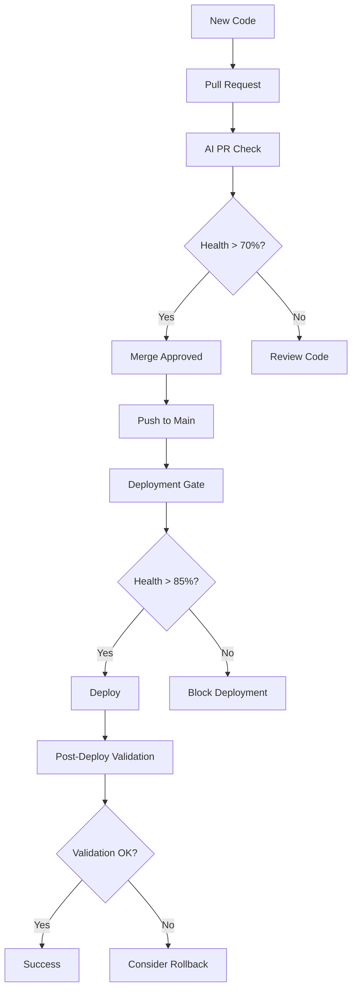

# 🤖 AI-Driven DevOps Complete Guide

## 🎯 Overview

This AI-Driven DevOps system provides intelligent analysis and decision-making for your deployment pipeline using AWS Bedrock AI models. It performs comprehensive health checks, analyzes system metrics, and provides recommendations for deployment decisions.

## 🔄 How It Works

### 🧠 AI Analysis Engine

The system uses **AWS Bedrock** (Amazon Nova Pro) to analyze:
- **Application Performance**: Response times, throughput, error rates
- **Infrastructure Health**: CPU, memory, disk usage, network metrics
- **Kubernetes Metrics**: Pod status, resource utilization, scaling events
- **Historical Patterns**: Trend analysis and anomaly detection

### 📊 Analysis Types

#### 1. **Pre-Deployment Analysis** 🚦
**Purpose**: Prevent problematic deployments before they happen

**Characteristics**:
- **Timing**: Before deployment execution
- **Data Source**: Historical data and simulations
- **Decision Power**: Can **BLOCK** deployments
- **Threshold**: 70-85% depending on environment
- **Mode**: `blocking-mode: true`

**Use Cases**:
- Pull Request validation
- Production deployment gates
- Release candidate approval

#### 2. **Post-Deployment Analysis** ✅
**Purpose**: Validate deployment success and system stability

**Characteristics**:
- **Timing**: After deployment completion
- **Data Source**: Real-time system metrics
- **Decision Power**: Reports status, suggests rollback
- **Threshold**: 85%+ for production validation
- **Mode**: `blocking-mode: false`

**Use Cases**:
- Deployment validation
- Health monitoring
- Rollback recommendations

#### 3. **Continuous Monitoring** 📈
**Purpose**: Ongoing system health surveillance

**Characteristics**:
- **Timing**: Scheduled (every 6 hours) or on-demand
- **Data Source**: Live system metrics
- **Decision Power**: Creates alerts and issues
- **Threshold**: 80% for monitoring alerts
- **Mode**: `blocking-mode: false`

## 🛠️ Workflow Types

### 1. **Pull Request Check** (`pull-request-check.yml`)
```yaml
# Triggered on: PR creation/updates
# Purpose: Early feedback on code changes
# Blocking: No (informational only)
# Threshold: 70% (permissive for development)
```

**Features**:
- AI analysis of proposed changes
- Automated PR comments with health scores
- Non-blocking validation
- Development-friendly thresholds

### 2. **Deployment Gate** (`deployment-gate.yml`)
```yaml
# Triggered on: Push to main branch
# Purpose: Production deployment protection
# Blocking: Yes (can prevent deployment)
# Threshold: 85% (strict for production)
```

**Features**:
- Real-time system analysis
- Deployment blocking capability
- Production-grade validation
- Immediate feedback on deployment readiness

### 3. **Post-Deployment Validation** (`post-deployment-validation.yml`)
```yaml
# Triggered on: Manual after deployment
# Purpose: Validate deployment success
# Blocking: No (reports status)
# Threshold: 85% (high for validation)
```

**Features**:
- Stabilization waiting period
- Extended monitoring duration
- Double validation (initial + final)
- Comprehensive deployment reports
- Rollback recommendations

### 4. **Scheduled Monitoring** (`ai-scheduled-monitoring.yml`)
```yaml
# Triggered on: Cron schedule (every 6 hours)
# Purpose: Continuous health surveillance
# Blocking: No (monitoring only)
# Threshold: 80% (balanced for alerts)
```

**Features**:
- Multi-environment monitoring
- Automated issue creation
- Health trend analysis
- Proactive alerting

## 🎮 Configuration Parameters

### Core Settings
```yaml
simulation-mode: 'false'      # Use real data vs simulated
blocking-mode: 'true'         # Can block deployment
health-threshold: '85'        # Minimum health score (0-100)
```

### AWS Bedrock
```yaml
bedrock-model-id: 'amazon.nova-pro-v1:0'  # AI model to use
```

### Application Context
```yaml
namespace: 'blackjack-demo'    # Kubernetes namespace
app-name: 'blackjack-app'     # Application name
cluster-name: 'automode-cluster'  # EKS cluster name
```

### Monitoring Integration
```yaml
prometheus-url: ${{ secrets.PROM_URL }}      # Metrics source
grafana-url: ${{ secrets.GRAFANA_URL }}      # Dashboard URL
grafana-token: ${{ secrets.GRAFANA_TOKEN }}  # API access
```

## 📈 Health Scoring System

### Score Ranges
- **90-100**: Excellent health, optimal performance
- **80-89**: Good health, minor optimizations possible
- **70-79**: Acceptable health, monitoring recommended
- **60-69**: Degraded performance, attention needed
- **0-59**: Critical issues, immediate action required

### Factors Analyzed
1. **Application Performance** (30%)
   - Response time percentiles
   - Error rates and types
   - Throughput metrics

2. **Infrastructure Health** (25%)
   - CPU and memory utilization
   - Disk space and I/O
   - Network performance

3. **Kubernetes Metrics** (25%)
   - Pod health and readiness
   - Resource requests vs limits
   - Scaling behavior

4. **Historical Trends** (20%)
   - Performance degradation patterns
   - Anomaly detection
   - Seasonal variations

## 🚀 Implementation Guide

### Step 1: Setup Secrets
```bash
# AWS Configuration
AWS_ACCESS_KEY_ID=your_access_key
AWS_SECRET_ACCESS_KEY=your_secret_key

# Bedrock Model
BEDROCK_MODEL_ID=amazon.nova-pro-v1:0

# Monitoring (Optional)
PROM_URL=https://prometheus.example.com
GRAFANA_URL=https://grafana.example.com
GRAFANA_TOKEN=your_grafana_token

# Notifications (Optional)
TELEGRAM_BOT_TOKEN=your_bot_token
TELEGRAM_CHAT_ID=your_chat_id
```

### Step 2: Choose Workflow
1. Copy appropriate example from `/examples/`
2. Place in `.github/workflows/`
3. Customize configuration parameters
4. Test with simulation mode first

### Step 3: Gradual Rollout
1. Start with **Pull Request checks** (non-blocking)
2. Add **Scheduled monitoring** (observability)
3. Implement **Deployment gates** (protection)
4. Enable **Post-deployment validation** (verification)

## 🔧 Troubleshooting

### Common Issues
1. **Low Health Scores**: Start with lower thresholds (60-70%)
2. **AWS Permissions**: Ensure Bedrock access is enabled
3. **Missing Metrics**: Verify Prometheus/Grafana connectivity
4. **False Positives**: Tune thresholds based on your application

## 🎯 Complete Workflow

### Development → Production


## 🤝 Contributing

Feel free to contribute to this project by submitting issues, feature requests, or pull requests.

## 📄 License

This project is licensed under the MIT License.

---

**Happy AI-driven DevOps!** 🤖✨

*Powered by [roxsross/ai-driven-devops](https://github.com/roxsross/ai-driven-devops)*
