# 🤖 Guía Completa de DevOps Impulsado por IA

## 🎯 Descripción General

Este sistema de DevOps impulsado por IA proporciona análisis inteligente y toma de decisiones para tu pipeline de despliegue utilizando modelos de IA de AWS Bedrock. Realiza verificaciones de salud integrales, analiza métricas del sistema y proporciona recomendaciones para decisiones de despliegue.

## 🔄 Cómo Funciona

### 🧠 Motor de Análisis IA

El sistema utiliza **AWS Bedrock** (Amazon Nova Pro) para analizar:
- **Rendimiento de Aplicación**: Tiempos de respuesta, throughput, tasas de error
- **Salud de Infraestructura**: CPU, memoria, uso de disco, métricas de red
- **Métricas de Kubernetes**: Estado de pods, utilización de recursos, eventos de escalado
- **Patrones Históricos**: Análisis de tendencias y detección de anomalías

### 📊 Tipos de Análisis

#### 1. **Análisis Pre-Despliegue** 🚦
**Propósito**: Prevenir despliegues problemáticos antes de que ocurran

**Características**:
- **Momento**: Antes de la ejecución del despliegue
- **Fuente de Datos**: Datos históricos y simulaciones
- **Poder de Decisión**: Puede **BLOQUEAR** despliegues
- **Umbral**: 70-85% dependiendo del entorno
- **Modo**: `blocking-mode: true`

**Casos de Uso**:
- Validación de Pull Requests
- Puertas de despliegue en producción
- Aprobación de candidatos de release

#### 2. **Análisis Post-Despliegue** ✅
**Propósito**: Validar el éxito del despliegue y la estabilidad del sistema

**Características**:
- **Momento**: Después de completar el despliegue
- **Fuente de Datos**: Métricas del sistema en tiempo real
- **Poder de Decisión**: Reporta estado, sugiere rollback
- **Umbral**: 85%+ para validación en producción
- **Modo**: `blocking-mode: false`

**Casos de Uso**:
- Validación de despliegue
- Monitoreo de salud
- Recomendaciones de rollback

#### 3. **Monitoreo Continuo** 📈
**Propósito**: Vigilancia continua de la salud del sistema

**Características**:
- **Momento**: Programado (cada 6 horas) o bajo demanda
- **Fuente de Datos**: Métricas del sistema en vivo
- **Poder de Decisión**: Crea alertas e issues
- **Umbral**: 80% para alertas de monitoreo
- **Modo**: `blocking-mode: false`

## 🛠️ Tipos de Workflows

### 1. **Verificación de Pull Request** (`pull-request-check.yml`)
```yaml
# Activado en: Creación/actualización de PR
# Propósito: Retroalimentación temprana sobre cambios de código
# Bloqueo: No (solo informativo)
# Umbral: 70% (permisivo para desarrollo)
```

**Características**:
- Análisis IA de cambios propuestos
- Comentarios automáticos en PR con puntuaciones de salud
- Validación no bloqueante
- Umbrales amigables para desarrollo

### 2. **Puerta de Despliegue** (`deployment-gate.yml`)
```yaml
# Activado en: Push a rama main
# Propósito: Protección de despliegue en producción
# Bloqueo: Sí (puede prevenir despliegue)
# Umbral: 85% (estricto para producción)
```

**Características**:
- Análisis del sistema en tiempo real
- Capacidad de bloqueo de despliegue
- Validación de grado de producción
- Retroalimentación inmediata sobre preparación para despliegue

### 3. **Validación Post-Despliegue** (`post-deployment-validation.yml`)
```yaml
# Activado en: Manual después del despliegue
# Propósito: Validar éxito del despliegue
# Bloqueo: No (reporta estado)
# Umbral: 85% (alto para validación)
```

**Características**:
- Período de espera para estabilización
- Duración de monitoreo extendido
- Doble validación (inicial + final)
- Reportes integrales de despliegue
- Recomendaciones de rollback

### 4. **Monitoreo Programado** (`ai-scheduled-monitoring.yml`)
```yaml
# Activado en: Programación cron (cada 6 horas)
# Propósito: Vigilancia continua de salud
# Bloqueo: No (solo monitoreo)
# Umbral: 80% (balanceado para alertas)
```

**Características**:
- Monitoreo multi-entorno
- Creación automática de issues
- Análisis de tendencias de salud
- Alertas proactivas

## 🎮 Parámetros de Configuración

### Configuraciones Principales
```yaml
simulation-mode: 'false'      # Usar datos reales vs simulados
blocking-mode: 'true'         # Puede bloquear despliegue
health-threshold: '85'        # Puntuación mínima de salud (0-100)
```

### AWS Bedrock
```yaml
bedrock-model-id: 'amazon.nova-pro-v1:0'  # Modelo IA a usar
```

### Contexto de Aplicación
```yaml
namespace: 'blackjack-demo'    # Namespace de Kubernetes
app-name: 'blackjack-app'     # Nombre de aplicación
cluster-name: 'automode-cluster'  # Nombre del cluster EKS
```

### Integración de Monitoreo
```yaml
prometheus-url: ${{ secrets.PROM_URL }}      # Fuente de métricas
grafana-url: ${{ secrets.GRAFANA_URL }}      # URL del dashboard
grafana-token: ${{ secrets.GRAFANA_TOKEN }}  # Acceso API
```

## 📈 Sistema de Puntuación de Salud

### Rangos de Puntuación
- **90-100**: Salud excelente, rendimiento óptimo
- **80-89**: Buena salud, optimizaciones menores posibles
- **70-79**: Salud aceptable, monitoreo recomendado
- **60-69**: Rendimiento degradado, atención necesaria
- **0-59**: Problemas críticos, acción inmediata requerida

### Factores Analizados
1. **Rendimiento de Aplicación** (30%)
   - Percentiles de tiempo de respuesta
   - Tasas y tipos de error
   - Métricas de throughput

2. **Salud de Infraestructura** (25%)
   - Utilización de CPU y memoria
   - Espacio en disco e I/O
   - Rendimiento de red

3. **Métricas de Kubernetes** (25%)
   - Salud y preparación de pods
   - Solicitudes vs límites de recursos
   - Comportamiento de escalado

4. **Tendencias Históricas** (20%)
   - Patrones de degradación de rendimiento
   - Detección de anomalías
   - Variaciones estacionales

## 🚀 Guía de Implementación

### Paso 1: Configurar Secretos
```bash
# Configuración AWS
AWS_ACCESS_KEY_ID=tu_access_key
AWS_SECRET_ACCESS_KEY=tu_secret_key

# Modelo Bedrock
BEDROCK_MODEL_ID=amazon.nova-pro-v1:0

# Monitoreo (Opcional)
PROM_URL=https://prometheus.ejemplo.com
GRAFANA_URL=https://grafana.ejemplo.com
GRAFANA_TOKEN=tu_grafana_token

# Notificaciones (Opcional)
TELEGRAM_BOT_TOKEN=tu_bot_token
TELEGRAM_CHAT_ID=tu_chat_id
```

### Paso 2: Elegir Workflow
1. Copiar ejemplo apropiado de `/examples/`
2. Colocar en `.github/workflows/`
3. Personalizar parámetros de configuración
4. Probar primero con modo simulación

### Paso 3: Despliegue Gradual
1. Comenzar con **verificaciones de Pull Request** (no bloqueante)
2. Agregar **monitoreo programado** (observabilidad)
3. Implementar **puertas de despliegue** (protección)
4. Habilitar **validación post-despliegue** (verificación)

## 🔧 Solución de Problemas

### Problemas Comunes
1. **Puntuaciones Bajas de Salud**: Comenzar con umbrales más bajos (60-70%)
2. **Permisos AWS**: Asegurar que el acceso a Bedrock esté habilitado
3. **Métricas Faltantes**: Verificar conectividad Prometheus/Grafana
4. **Falsos Positivos**: Ajustar umbrales basados en tu aplicación

## 🎯 Flujo de Trabajo Completo

### Desarrollo → Producción

```mermaid
graph TD
    A[Código Nuevo] --> B[Pull Request]
    B --> C[AI PR Check]
    C --> D{¿Salud > 70%?}
    D -->|Sí| E[Merge Aprobado]
    D -->|No| F[Revisar Código]
    E --> G[Push a Main]
    G --> H[Deployment Gate]
    H --> I{¿Salud > 85%?}
    I -->|Sí| J[Desplegar]
    I -->|No| K[Bloquear Despliegue]
    J --> L[Post-Deploy Validation]
    L --> M{¿Validación OK?}
    M -->|Sí| N[Éxito]
    M -->|No| O[Considerar Rollback]
```


## 🤝 Contribuciones

Siéntete libre de contribuir a este proyecto enviando issues, solicitudes de características o pull requests.

## 📄 Licencia

Este proyecto está licenciado bajo la Licencia MIT.

---

**¡Feliz DevOps impulsado por IA!** 🤖✨

*Powered by [roxsross/ai-driven-devops](https://github.com/roxsross/ai-driven-devops)*
